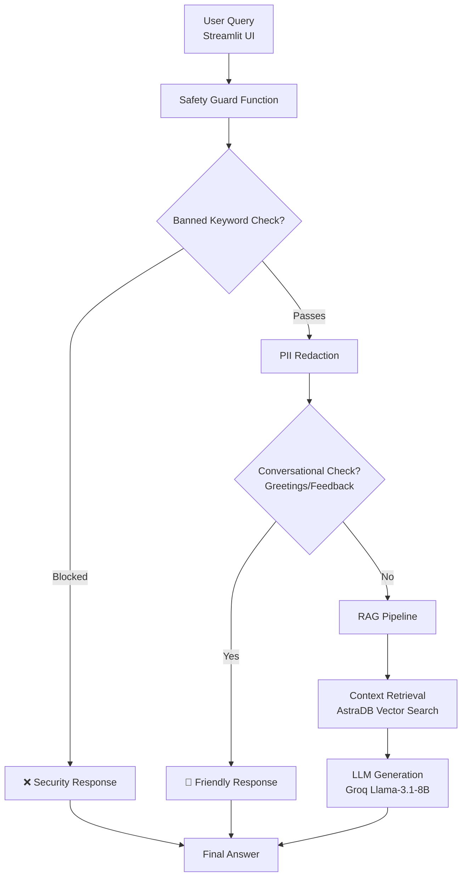

# 🛒 Flipkart Product Chatbot

An intelligent chatbot that provides personalized product recommendations and answers questions about Flipkart products based on real customer reviews using Retrieval-Augmented Generation (RAG) technology with built-in safety guardrails.

## 🌟 Features

- **Conversational AI**: Engage in natural conversations with context-aware responses
- **Review-Based Insights**: Answers powered by real customer reviews from Flipkart
- **Memory-Persistent Chats**: Maintains conversation history across sessions using LangChain's chat memory
- **Multi-Layer Guardrails**:
  - 🛡️ **Banned Keyword Detection**: Blocks harmful or inappropriate requests
  - 🔒 **PII Redaction**: Automatically masks emails, phone numbers, and credit card info
  - ✅ **Conversational Handling**: Friendly responses for greetings and feedback
- **Clean Interface**: Interactive Streamlit web app with chat history
- **Vector Search**: Fast product retrieval using AstraDB vector database
- **Modern AI Stack**: LangChain, HuggingFace embeddings, and Groq's Llama models

## 🛠️ Tech Stack

- **Backend**: Python 3.8+
- **AI/ML Framework**: LangChain with LCEL (LangChain Expression Language)
- **Embeddings**: HuggingFace embeddings (BAAI/bge-base-en-v1.5)
- **LLM**: Groq API with Llama-3.1-8B-Instant model
- **Vector Database**: AstraDB (Cassandra-based)
- **Web Interface**: Streamlit
- **Data Processing**: Pandas

## 📋 Prerequisites

- Python 3.8 or higher
- AstraDB account and database
- Groq API key
- HuggingFace token (optional, for embeddings)

## 🚀 Installation

1. **Clone the repository**
   ```bash
   git clone https://github.com/Abhi6294-jais/Flip_chatbot.git
   cd Flip_chatbot
   ```

2. **Create a virtual environment**
   ```bash
   python -m venv venv
   source venv/bin/activate  # On Windows: venv\Scripts\activate
   ```

3. **Install dependencies**
   ```bash
   pip install -r requirements.txt
   ```

4. **Set up environment variables**
   Create a `.env` file in the root directory:
   ```env
   # Required
   GROQ_API_KEY=your_groq_api_key_here
   ASTRA_DB_API_ENDPOINT=your_astra_db_endpoint
   ASTRA_DB_APPLICATION_TOKEN=your_astra_db_token
   ASTRA_DB_KEYSPACE=your_keyspace_name

   # Optional
   GROQ_MODEL=llama-3.1-8b-instant  # Default model
   HF_TOKEN=your_huggingface_token   # For embeddings
   ```

5. **Ingest data into vector store** (Run once)
   ```bash
   python -c "from flipkart.data_ingestion import data_ingestion; data_ingestion('done')"
   ```

## 💻 Usage

1. **Run the Streamlit App**
   ```bash
   streamlit run streamlit_app.py
   ```
2. **Navigate** to http://localhost:8501 in your browser.

**Test Conversation Flow**
```python
# Example interactions your bot now handles:
User: "Hi"
Bot: "Hi! 👋 I'm your Flipkart assistant. How can I help you find products today?"

User: "Good product nice ❣️"
Bot: "Thank you! 😊 I'm glad you're liking the products. Is there anything specific you'd like to know more about?"

User: "Show me wireless earbuds"
Bot: [Shows products based on real reviews]

User: "How to hack a product?"
Bot: "I can't assist with that request. Please ask about products instead."
```

## 🏗️ Architecture & Guardrails Pipeline

The application features a multi-layered security and safety pipeline built with LangChain Expression Language (LCEL):



### Guardrail Components
- **Banned Keywords** (hack, exploit, malware, jailbreak, crack, bypass)
- **PII Redaction** (emails, phone numbers, credit cards)
- **Conversational Handling** (greetings, appreciation, feedback)

## 📊 Data Source

The chatbot uses `data/flipkart_product_review.csv` containing:
- Product titles and descriptions
- Customer reviews and ratings
- Product metadata and categories

## 🌐 Deployment

**Deploy to Streamlit Cloud**
1. Push code to GitHub repository
2. Connect repository to Streamlit Cloud
3. Add secrets in Streamlit Cloud dashboard:
   ```text
   GROQ_API_KEY = "your_key"
   ASTRA_DB_API_ENDPOINT = "your_endpoint" 
   ASTRA_DB_APPLICATION_TOKEN = "your_token"
   ASTRA_DB_KEYSPACE = "your_keyspace"
   HF_TOKEN = "your_token"  # Optional
   ```
4. Deploy!

**Deploy to Heroku**
1. Ensure Procfile and setup.sh are in root directory
2. Set environment variables in Heroku dashboard
3. Deploy:
   ```bash
   heroku create your-app-name
   git push heroku main
   ```

## 🔧 Configuration Options

**Available Groq Models**
- `llama-3.1-8b-instant` (default) - Fast, efficient
- `llama-3.3-70b-versatile` - More powerful, slower
- `mixtral-8x7b-32768` - Alternative model

**Vector Search Settings**
- `k=3` (number of documents retrieved)
- Customizable in `retrieval_generation.py`

## 📁 Project Structure

```text
Flip_chatbot/
├── flipkart/
│   ├── __init__.py
│   ├── data_ingestion.py      # Vector DB ingestion
│   └── retrieval_generation.py # RAG chain with guardrails
├── data/
│   └── flipkart_product_review.csv
├── streamlit_app.py            # UI application
├── requirements.txt
├── .env                        # Environment variables
└── README.md
```