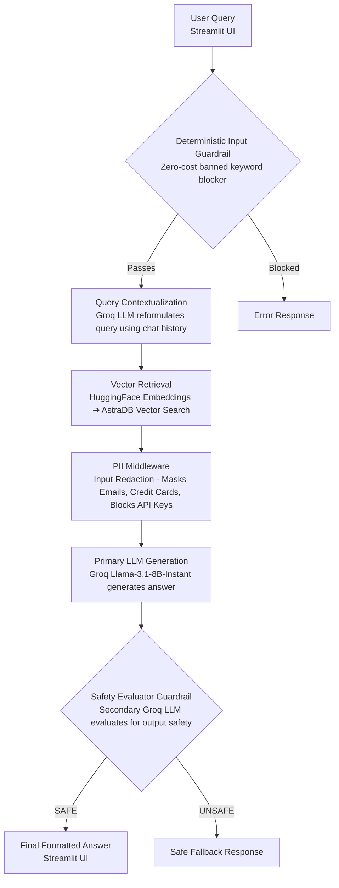

# 🛒 Flipkart Product Chatbot

An intelligent chatbot that provides personalized product recommendations and answers questions about Flipkart products based on real customer reviews using Retrieval-Augmented Generation (RAG) technology.

## 🌟 Features

- **Conversational AI**: Engage in natural conversations about products with context-aware responses
- **Review-Based Insights**: Answers powered by real customer reviews from Flipkart
- **Memory-Persistent Chats**: Maintains conversation history across sessions
- **Interface**: Clean, interactive Streamlit web app
- **Vector Search**: Fast and accurate product information retrieval using AstraDB
- **Modern AI Stack**: Built with LangChain, HuggingFace embeddings, and Groq's Llama models

## 🛠️ Tech Stack

- **Backend**: Python 3.8+
- **AI/ML**:
  - LangChain for RAG pipeline
  - HuggingFace embeddings (BAAI/bge-base-en-v1.5)
  - Groq API with Llama-3.1-8B model
- **Database**: AstraDB (Apache Cassandra-based vector database)
- **Web Frameworks**:
  - Streamlit for quick prototyping and deployment
- **Data Processing**: Pandas for CSV handling

## 📋 Prerequisites

- Python 3.8 or higher
- AstraDB account and database
- Groq API key
- HuggingFace token (optional, for enhanced embeddings)

## 🚀 Installation

1. **Clone the repository**
   ```bash
   git clone https://github.com/Abhi6294-jais/Flip_chatbot.git
   cd Flip_chatbot
   ```

2. **Create a virtual environment**
   ```bash
   python -m venv venv
   source venv/bin/activate  # On Windows: venv\Scripts\activate
   ```

3. **Install dependencies**
   ```bash
   pip install -r requirements.txt
   ```

4. **Set up environment variables**

   Create a `.env` file in the root directory:
   ```env
   GROQ_API_KEY=your_groq_api_key_here
   ASTRA_DB_API_ENDPOINT=your_astra_db_endpoint
   ASTRA_DB_APPLICATION_TOKEN=your_astra_db_token
   ASTRA_DB_KEYSPACE=your_keyspace_name
   HF_TOKEN=your_huggingface_token  # Optional
   ```

5. **Ingest data into vector store** (Run once to set up the database)
   ```bash
   python -c "from flipkart.data_ingestion import data_ingestion; data_ingestion(None)"
   ```

## 💻 Usage

```bash
streamlit run streamlit_app.py
```

Navigate to `http://localhost:8501` in your browser.

### 🌐 Deploy to Streamlit Cloud or Heroku

1. Ensure the repository has `requirements.txt`, `Procfile`, and `.streamlit/config.toml`.
2. Set secrets in your hosting dashboard:
   - `GROQ_API_KEY`
   - `ASTRA_DB_API_ENDPOINT`
   - `ASTRA_DB_APPLICATION_TOKEN`
   - `ASTRA_DB_KEYSPACE`
   - `HF_TOKEN` (optional)
3. (Streamlit Cloud) create an app from this GitHub repo.
4. (Heroku) push to Heroku git remote, then `git push heroku main`.

The app should start automatically on the assigned public URL.

## 📊 Data Source

The chatbot uses the `data/flipkart_product_review.csv` file containing:
- Product titles
- Customer reviews
- Product metadata

The data is processed and stored in AstraDB for efficient vector similarity search.

## 🏗️ Architecture & Guardrails Pipeline

The RAG application is fortified with a multi-layered LangChain Expression Language (LCEL) pipeline prioritizing security, cost-efficiency, and context awareness.



## 🔧 Configuration

### AstraDB Setup
1. Create an AstraDB database
2. Note down the API endpoint, token, and keyspace
3. Ensure the collection name is set to "flipkart"

### Groq API
1. Sign up at [Groq Console](https://console.groq.com/)
2. Generate an API key
3. Use the Llama-3.1-8B model for optimal performance

## 🤝 Contributing

1. Fork the repository
2. Create a feature branch (`git checkout -b feature/amazing-feature`)
3. Commit your changes (`git commit -m 'Add amazing feature'`)
4. Push to the branch (`git push origin feature/amazing-feature`)
5. Open a Pull Request

## 📝 License

This project is licensed under the MIT License - see the [LICENSE](LICENSE) file for details.

## 🙏 Acknowledgments

- Flipkart for providing the product review dataset
- LangChain community for the RAG framework
- AstraDB for vector database capabilities
- Groq for fast LLM inference

## 📞 Support

For questions or issues, please open an issue on GitHub or contact the maintainer at abhishekiitpmc03@gmail.com.

---

**Made with ❤️ by Abhishek Jaiswal**